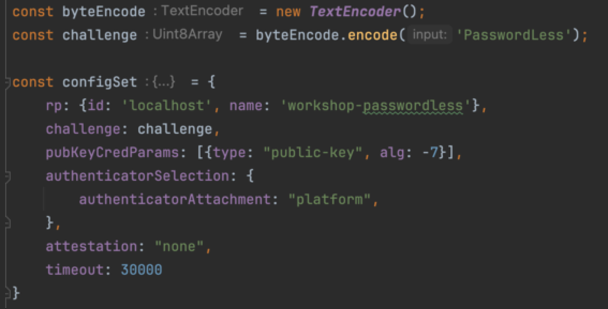
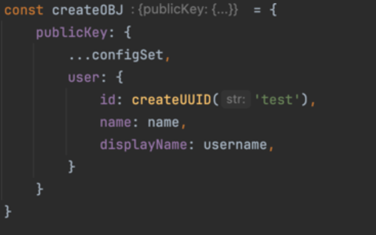

# Workshop PasswordLess
___
## Agenda
- How to start
- What do we build
- Examples
- Presentations
---
## How to start
This workshop can be done with any Javascript library so pick one and get ready to start.
Probably most easy to start with a default setup.

### For Angular:
To do the workshop with angular use following command:

1. yarn install -g @angular/cli
2. ng new [your name]
3. Start project with ng serve

### For React:
To do the workshop with react use following steps:

1. yarn install -g npx
2. npx create-react-app [your name] --template typescript
3. Start project with: yarn start
___
## What do we build 
In this workshop we will build an application for our user where they don't need to remember passwords to use our web/app. The key goal of this workshop is to think about how to make this friendly and secure for our users.
So before you make the deep-dive into the examples (or internet) think about the most important flows users use to interact with your application.

- Account Register
- Account Login
- Account Recovery
- Account Deletion

How hard/time-consuming are you going to make each step for the user? Is this the best/safest way to let your users interact with your application?
For example as a user I don't want to receive an email, sms and push notification for every login I need to do. But pressing the biometric to verify is not that intrusive. (Or can you make it even better?)

Advance things to think about:

- Is a user his account safe if his email is hacked?
- What if the user phone got stolen?

These cases are pretty hard and might be less troubling than the case itself for the user. But it's nice to see if you can find a way to block this. You might need to specify what kind of application you are to add more security. (e.g. bank or supermarket)
___
## Examples
Here are some examples which you can use. 

### SMS one-time code
Reading an incoming sms from the browser. This will make it easy to get the code in your website.

`<input type="text" autocomplete="one-time-code" inputmode="numeric">`

But making it automatically is also possible with this:

`navigator.credentials.get({ otp: {transport:['sms']} }).then(otp => input.value = otp.code);`

Small not is that the domain should be added to the sms so for example

`123456 example code`

`@openweb.nl #123456`

On Mac you can create your own website by adding an entry inside your etc/hosts file.
There should already be a `127.0.0.1 localhost` add something like `127.0.0.1 passwordless.workshop`
Than inside your browser you can go to passwordless.workshop and use this as a domain inside the sms.
(Note, you can send yourself a sms to test this, or ask someone to text you the message)

More information: 
- https://developer.mozilla.org/en-US/docs/Web/API/OTPCredential
- https://dev.to/madsstoumann/using-a-single-input-for-one-time-code-352l

### Password Credentials API
The credentials api from javascript gives you the option to store a username and password inside the browser.
I know we want password-less but the password you place in the credential manager doesn't have to be a user password. We can also use it as a token refresher so the user doesn't have to remember anything but the browser can help retrieving it.

Creating a Password Credential: 

`const pc = new PasswordCredential({id: <string>, password: <string>})`

`await navigator.credentials.store(pc)`

Retrieving this information can be done with 3 options:

`const userCredentials = await navigator.credentials.get({password: true, mediation: <Silent, Optional or Required>});`

With the flag silent you will retrieve the information without any interaction needed from the user. Optional means the browser decides and Required means the user needs to approve the collection of the credentials.
Note if you have multiple credentials stored for your website Silent will ask the user which account should be fetched.

More information: 
- https://developer.mozilla.org/en-US/docs/Web/API/Navigator/credentials

### Passkey creation
To make this work properly you might need a password manager to do the heavy lifting al tough it should also work in web only.

Start with creating a challenge code and configuration.

After you have the configuration you can execute it with:

`const resp = await navigator.credentials.create(createOBJ);`

More information:

- https://developer.mozilla.org/en-US/docs/Web/API/CredentialsContainer/create
- https://developer.mozilla.org/en-US/docs/Web/API/PublicKeyCredentialCreationOptions

## Presentations
At the end of the workshop it's nice to see a few demo's and talk about choices we made for `register`, `login`, `reset` and `delete` account.
Let's see which person or persons made a friendly and secure application!
